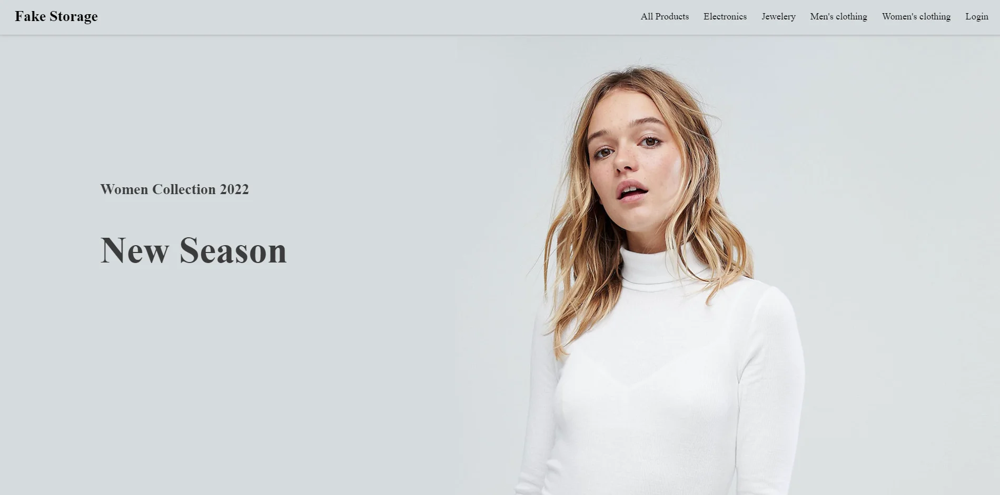
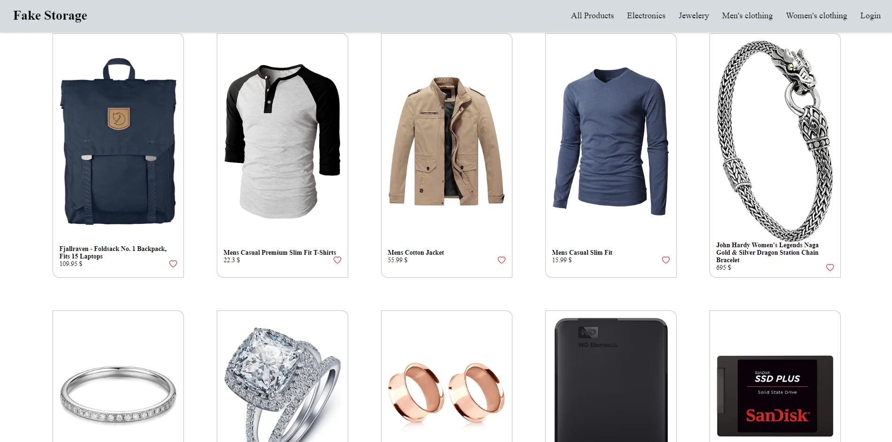
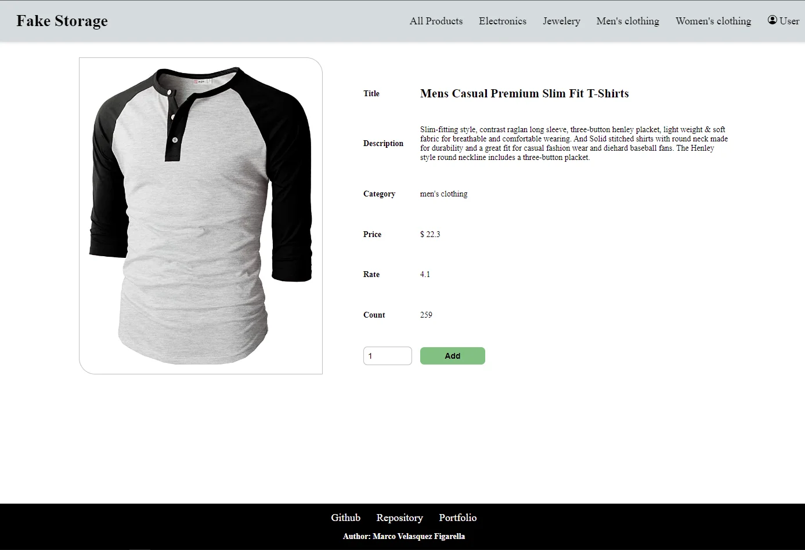

# `FakeStoreAPI`

Ejercicio de consumo de Api, desarrollo Responsive y Mobil First.

Diseño web propio con inspiración en template gratuito, se hizo simple para facilitar el desarrollo.

Hooks usados y ejercitados, useState y useEffect, UseContext, UseReducer.

Origen de API: https://fakestoreapi.com

Templete usado como inspiración: https://themewagon.com/themes/free-html5-ecommerce-website-template/

## Click para ver [Demo](https://marco90v.github.io/fakestoreapi/)

### `Desarrollo: `
* React
* React Router
* Fetch
* HTML
* CSS
* Grid
* Flexbox
* Movil First
* Keyframe
  
### `Vistas:`
* Home - Vista principal de la aplicación.
* Login - Vista inicio de sesión de usuario.
* User - Vista con datos del usuario, carro de compras y artículos favoritos.
* Details - Vista detallade del articulo seleccionado.

### `Componentes:`
* Header
* Footer
* Card
* Like
* Product

### `Capturas:`

### `yarn start`

Runs the app in the development mode.\
Open [http://localhost:3000](http://localhost:3000) to view it in your browser.

The page will reload when you make changes.\
You may also see any lint errors in the console.

### `yarn build`

Builds the app for production to the `build` folder.\
It correctly bundles React in production mode and optimizes the build for the best performance.

The build is minified and the filenames include the hashes.\
Your app is ready to be deployed!

See the section about [deployment](https://facebook.github.io/create-react-app/docs/deployment) for more information.

